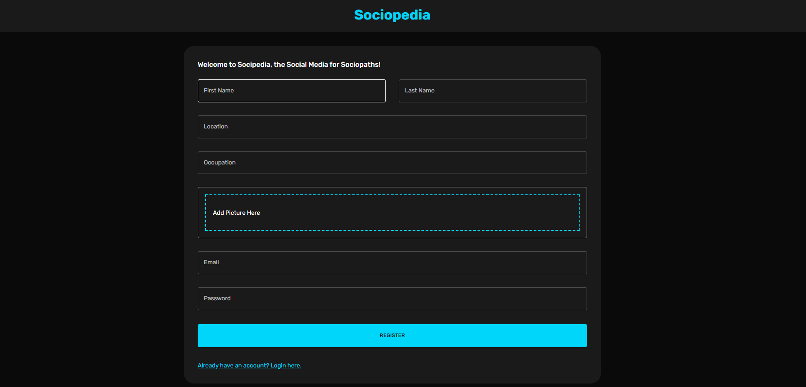
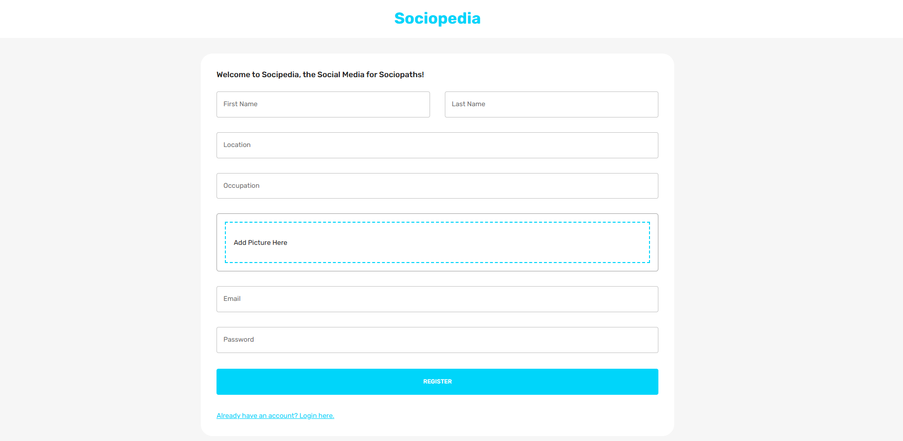
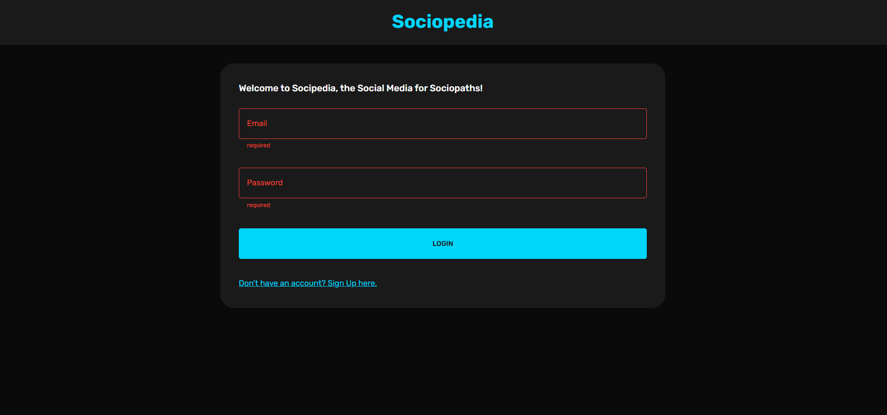
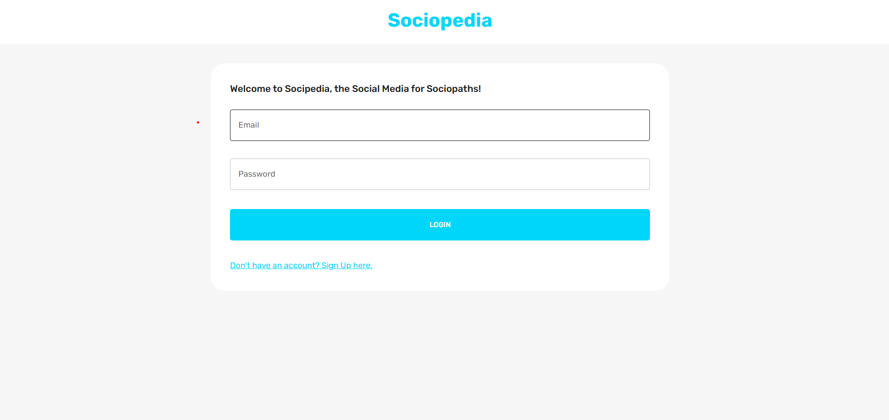
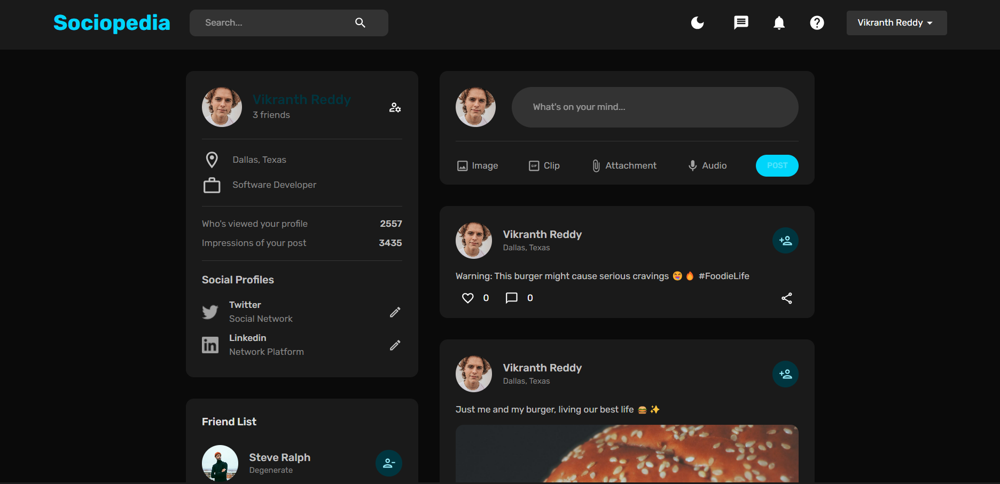
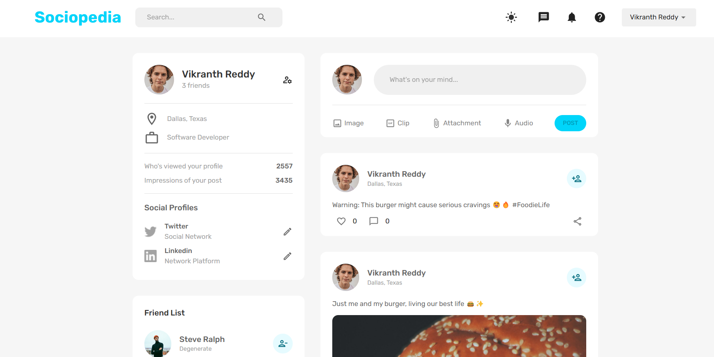
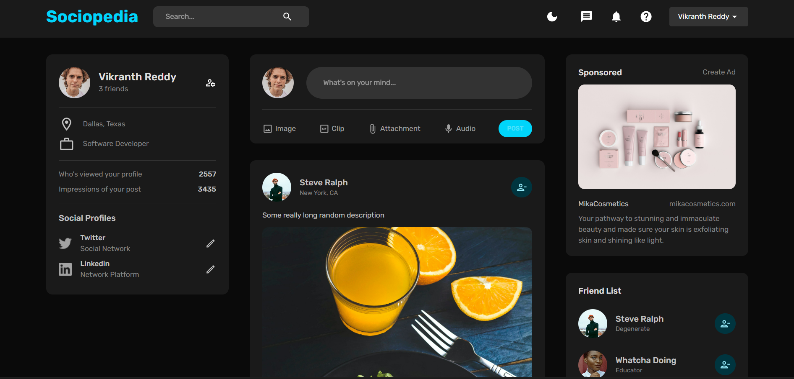

# Sociopedia

Sociopedia is a social media application where users can share posts, manage friends, and interact with others. It consists of a **frontend** built with React and a **backend** built with Node.js and Express.

## Features
- User authentication
- Post creation, liking, and commenting
- Friend management
- Responsive design with dark/light mode

## Project Structure
- `server/` - Backend code
- `client/` - Frontend code

## Snapshots
Here are some snapshots of the application:

### Sign up Page

### Login Page

### User Profile

### Post Feed

## Setup Instructions

For detailed setup instructions, refer to the respective README files:

- [Backend Setup Instructions](server/README.md)
- [Frontend Setup Instructions](client/README.md)

